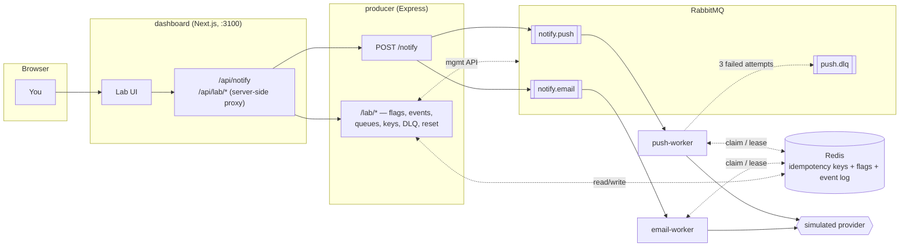
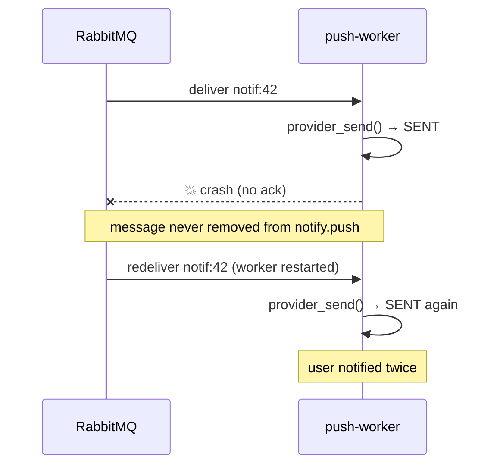
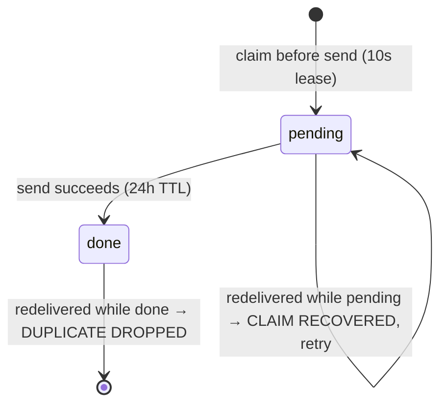

# Notification System Lab

A working notification pipeline — RabbitMQ fan-out, Node/Express producer and
workers, Redis-backed idempotency, and a Next.js dashboard — built to let you
**break it the way production breaks, then fix it**, one observable step at a
time.

One event goes in. It fans out to a push queue and an email queue, each with
its own worker. Then you deliberately crash a worker mid-delivery and watch
RabbitMQ redeliver the message, duplicating a user's notification. You fix it
with a Redis idempotency claim, discover the gap a naive claim still leaves,
close that gap with a two-state lease, and finally watch a permanently
failing notification survive retries with backoff before landing safely in a
dead-letter queue.

Everything — triggering events, toggling the fix flags, reading worker logs,
inspecting Redis keys and queue depths — happens from a browser dashboard.
No shell access required.

---

## Quick start

```bash
docker compose -f local-docker-compose.yml up -d --build
```

Then open:

| URL | What it is |
|---|---|
| **http://localhost:3100** | The lab dashboard — run scenarios, flip flags, watch logs |
| **http://localhost:15672** | RabbitMQ management UI (`guest` / `guest`) |

> `docker-compose.yml` (no prefix) is the **production** variant — it expects
> an external `redis` container and `backend-net` network to already exist,
> and ships Traefik labels for a reverse proxy. Use
> `local-docker-compose.yml` for running the stack standalone on your laptop,
> as described in this README.

---

## Architecture



- **producer** — an Express service. `POST /notify` writes one durable
  message per channel queue (`notify.push`, `notify.email`) — *queue per
  channel*, so a slow or dead channel never blocks the other. It never talks
  to the workers directly; RabbitMQ decouples them. It also hosts `/lab/*`,
  a small control-plane API the dashboard uses (see below).
- **push-worker / email-worker** — one Express worker per channel, each
  consuming only its own queue with `prefetch=1`. For every message it calls
  a simulated provider, logs the outcome, and only *then* acknowledges the
  message — the ack-after-send ordering is what makes the duplicate bug
  possible in the first place.
- **Redis** — not a cache here, a ledger: idempotency claims
  (`notification:<id>:<channel>:<user>`), the runtime fix-flags
  (`lab:flags`), and a capped event stream (`lab:events`) the dashboard tails
  instead of `docker compose logs`.
- **RabbitMQ** — the broker, at-least-once delivery. `push.dlq` /
  `email.dlq` hold messages that permanently fail.
- **dashboard** — a Next.js app. Every call to the producer or its `/lab`
  API is proxied **server-side** (Next.js route handlers) — the producer's
  port is never published to the host or browser.

---

## The bug, and how it gets fixed

This is the part worth understanding, not just running.

### 1. At-least-once delivery → duplicates

RabbitMQ only forgets a message once the consumer **acks** it. The push
worker sends the notification, then — on command — crashes *before* acking.
Docker restarts it, RabbitMQ sees the message was never acked, and
redelivers the exact same message. The fresh worker sends it again. The
broker did nothing wrong; at-least-once delivery means *at least* once.



### 2. Fix: an idempotency claim

Before sending, the worker claims a Redis key with `SET key NX EX 86400` —
succeeds once, fails on every later attempt. On redelivery the claim already
exists, so the worker logs `DUPLICATE DROPPED` and acks without resending.

### 3. The gap a single claim leaves

The claim is written *before* the provider is ever called. If the worker
crashes in that exact gap — claimed, but never sent — the redelivery finds
the claim, assumes it's a duplicate, and drops it. **The notification is now
silently lost**, not duplicated, with no error anywhere.

### 4. Fix: a claim that knows the difference

Split one permanent fact into two states:



A redelivery that finds `done` is a real duplicate — drop it. One that finds
`pending` means the previous attempt crashed before finishing — retry it for
real.

### 5. Retries, backoff, and the dead-letter queue

Some failures aren't transient — a user's device token can be permanently
invalid. The worker retries 3 times with exponential backoff (0.5s, 1s),
then publishes the message to `push.dlq` and acks the original. The poison
message is parked for inspection instead of blocking the queue or retrying
forever.

---

## Using the dashboard

Open **http://localhost:3100**. Everything below is driven from the UI —
no terminal needed.

- **System map** — a live diagram of the pipeline. Nodes pulse when a
  service logs an event; queue depths, worker health, and Redis key counts
  update every couple of seconds. It's pinned to the top of the page and
  collapsible, so it stays visible while you scroll through scenarios.
- **Lab scenarios** — six independent cards, each covering one step above
  (fan-out, the duplicate bug, the idempotency fix, the gap it leaves, the
  lease fix, retry + DLQ). Each card shows the concept, the flags it needs,
  a **Run step** button, the live worker logs for *that* notification only,
  and a verdict once the expected outcome is observed. Run them in any
  order — nothing is gated on a previous step.
- **Worker flags** — toggles `IDEMPOTENCY_ENABLED` and
  `CLAIM_LEASE_ENABLED` at runtime (stored in Redis, read by both workers on
  every message). This replaces editing `docker-compose.yml` and recreating
  containers.
- **Queues / Redis keys / Dead-letter queue** — live RabbitMQ queue depths,
  every `notification:*` key with its value and TTL, and a peek into
  `push.dlq` (inspect or purge without consuming).
- **Event stream** — a grep-able tail of every event every service has
  logged, sourced from the Redis stream.
- **Reset lab** — flags back to off, keys/queues/events cleared, for a clean
  re-run.

---

## Producer API

| Method & path | What it does |
|---|---|
| `POST /notify` | Body `{ "mode": "default" \| "crash" \| "crash-claim" \| "bad-token" }`. Queues one event. |
| `GET /lab/events?since=<id>` | Tails the event stream (used for live log polling). |
| `GET /lab/flags` / `PUT /lab/flags` | Read/write the runtime idempotency + claim-lease flags. |
| `GET /lab/keys` | Lists current `notification:*` Redis keys with value + TTL. |
| `GET /lab/queues` | Queue depths for `notify.push`, `notify.email`, `push.dlq`, `email.dlq`. |
| `GET /lab/dlq/:channel` / `DELETE /lab/dlq/:channel` | Peek or purge a dead-letter queue. |
| `GET /lab/workers` | Push/email worker liveness. |
| `POST /lab/reset` | Resets flags, clears keys/queues/events. |
| `GET /healthz` / `GET /readyz` / `GET /metrics` | Standard liveness, readiness, Prometheus metrics. |

The dashboard never calls these from the browser — `web/app/api/notify` and
`web/app/api/lab/[...path]` proxy them server-side over the Docker network.

---

## Repository layout

```
app/                    Express producer + workers (Node, amqplib, ioredis)
  src/producer/           POST /notify, /lab control-plane API
  src/worker/             per-channel consumer: claim, send, retry, DLQ, crash hooks
  src/labEvents.js         writes to the Redis event stream the dashboard reads
  src/labFlags.js          runtime idempotency/claim-lease flags in Redis

web/                    Next.js dashboard
  app/page.tsx             the lab UI
  app/lib/steps.ts          the 6 scenario definitions (concept, setup, verdict logic)
  app/components/          SystemMap, StepCard, Panels (flags/queues/keys/DLQ/events)
  app/api/                  server-side proxies to the producer

docker-compose.yml       production (external redis/network, Traefik)
local-docker-compose.yml local dev (standalone, ports published to localhost)
rabbitmq.conf             loopback_users=none — lets containers/host connect as guest
mgmt-proxy.conf           nginx in front of the RabbitMQ UI (strips oversized cookies)
```

---

## Learning outcomes

- Fan one event across per-channel queues and read deliveries from worker
  logs.
- Reproduce a real duplicate delivery (crash between send and ack).
- Fix it with an idempotency key (`notification:<id>:<channel>:<recipient>`,
  TTL) — and find the gap a single-claim design still leaves.
- Close that gap with a two-state (pending/done) claim lease.
- Watch retry + exponential backoff end in a dead-letter queue, not a stuck
  queue.
